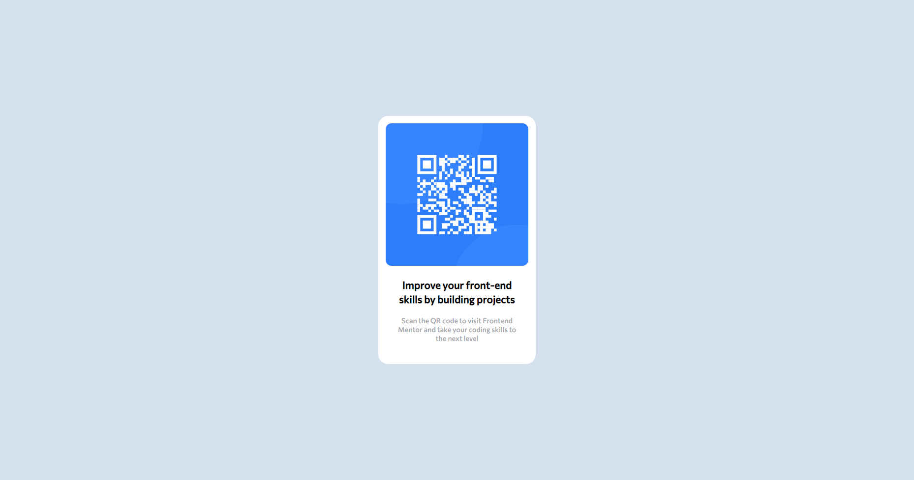

# Frontend Mentor - QR code component solution

This is a solution to the [QR code component challenge on Frontend Mentor](https://www.frontendmentor.io/challenges/qr-code-component-iux_sIO_H). Frontend Mentor challenges help you improve your coding skills by building realistic projects. 

## Table of contents

- [Overview](#overview)
  - [Screenshot](#screenshot)
  - [Links](#links)
- [My process](#my-process)
  - [Built with](#built-with)
- [Author](#author)
- [Acknowledgments](#acknowledgments)

**Note: Delete this note and update the table of contents based on what sections you keep.**

## Overview

### Screenshot

Desktop

Mobile

### Links

- Solution URL: [Here 🐱‍👤](https://github.com/aZ3Dx/qr-code-component-main)
- Live Site URL: [Here 📟](https://az3dx.github.io/qr-code-component-main/)

## My process

### Built with

- Flexbox
- Mobile-first workflow

## Author

- Website - Under development
- Frontend Mentor - [@aZ3Dx](https://www.frontendmentor.io/profile/aZ3Dx)